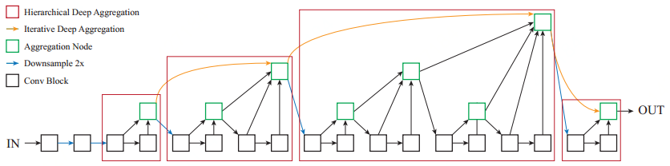

# DLA

[English](./README.md) | 简体中文
   
   * [DLA](#DLA)
      * [一、简介](#一简介)
      * [二、复现精度](#二复现精度)
      * [三、数据集](#三数据集)
      * [四、环境依赖](#四环境依赖)
      * [五、快速开始](#五快速开始)
         * [step1: clone](#step1-clone)
         * [step2: 训练](#step2-训练)
         * [step3: 测试](#step3-测试)
      * [六、代码结构与详细说明](#六代码结构与详细说明)
         * [6.1 代码结构](#61-代码结构)
         * [6.2 参数说明](#62-参数说明)
         * [6.3 训练流程](#63-训练流程)
            * [单机训练](#单机训练)
            * [多机训练](#多机训练)
         * [6.4 评估流程](#64-评估流程)
      * [七、模型信息](#七模型信息)

## 一、简介



DLA(Deep Layer Aggregation)基于更加紧密连接的思想，提出了一种创新的网络结构DLA，该网络中每一个Block都与ResNet中的残差Block一致，基于这些基础的Block提出了IDA(Iterative Deep Aggregation)和HDA(Hierarchical Deep Aggregation)两个子结构。前者用于融合不同分辨率/尺度上的feature，后者则合并所有的模块和通道的feature。

**论文:**[Deep Layer Aggregation](https://arxiv.org/abs/1707.06484)

## 二、复现精度（DLA60）

下表中是飞浆论文复现赛中提交的结果，为了迎合比赛对于高精度复现模型的需求，相对原版复现增加了label smooth等，原版复现的训练脚本为PaddleClas-release-2.0/run_train_dla60.sh，该版本达到dla60 top1:76.9%、top5 93.3%的要求。为了比赛的规则，我们建议采用高性能版本PaddleClas-release-2.0/run_train_dla60_best.sh进行复现。我们不光实现了dla60，还实现了"DLA60x", "DLA60x_c", "DLA46x_c", "DLA46_c", "DLA34"等多个版本代码

| 指标 | 原论文 | 复现精度 | log/model |
| --- | --- | --- | --- |
| top-1 err | 23.1 | 22.334 | [百度云提取码60kv](https://pan.baidu.com/s/1ljWRGOi3eoyZ85laZk-i3Q) |
| top-5 err | 6.7  | 5.996 | |

## 三、数据集

使用的数据集为：[ImageNet2012](https://www.image-net.org)。

- 数据集大小：1000个类别，128W张常规的自然图像
  - 训练集：128W张图像
  - 验证集：5W张图像
  - 测试集：10W张图像
- 数据格式：图片后缀以.JPEG结尾

## 四、环境依赖

- 硬件：GPU、CPU

- 框架：
  - PaddlePaddle >= 2.0.0

## 五、快速开始

### step1: clone 
本项目基于[PaddleClas](https://github.com/PaddlePaddle/PaddleClas)开发，更具体的应该说是基于该项目的[release/2.0](https://github.com/PaddlePaddle/PaddleClas/tree/release/2.0)分支开发完成

``` bash
# clone this repo
git clone https://github.com/PaddlePaddle/Contrib
cd Contrib/DLA
```

### step2: 训练
```python
CUDA_VISIBLE_DEVICES=0,1,2,3 python -m paddle.distributed.launch \
                            --gpus="0,1,2,3" tools/train.py -c ./configs/DLA/DLA60_best.yaml
```
or
```bash
bash run_train_dla60_best.sh
```

此时的输出为：
```bash
2021-04-09 11:43:30 INFO: epoch:0  , train step:0   , loss: 6.95827, lr: 0.000000, batch_cost: 2.96576 s, reader_cost: 1.85705 s, ips: 21.57965 images/sec.
2021-04-09 11:43:34 INFO: epoch:0  , train step:10  , loss: 6.96350, lr: 0.000032, batch_cost: 0.40174 s, reader_cost: 0.00584 s, ips: 159.30689 images/sec.
2021-04-09 11:43:38 INFO: epoch:0  , train step:20  , loss: 6.92945, lr: 0.000064, batch_cost: 0.39820 s, reader_cost: 0.00219 s, ips: 160.72153 images/sec.
```
由于是分类任务，需要关注 ``loss`` 逐渐降低。

### step3: 测试
```python
CUDA_VISIBLE_DEVICES=0 python tools/eval.py \
                        -c ./configs/DLA/DLA60_best.yaml \
                        -o pretrained_model='output/DLA60/best_model/ppcls' \
                        -o load_static_weights=False
```
or
```bash
bash run_test_dla60_best.sh
```

此时的输出为（截取了log的末尾，包含性能分）：
```bash

2021-04-15 11:15:04 INFO: epoch:0  , valid step:300 , top1: 0.85156, top5: 0.93750, loss: 1.64211, lr: 0.000000, batch_cost: 0.46342 s, reader_cost: 0.26118 s, ips: 276.20987 images/sec.
2021-04-15 11:15:09 INFO: epoch:0  , valid step:310 , top1: 0.79688, top5: 0.96875, loss: 1.73452, lr: 0.000000, batch_cost: 0.46496 s, reader_cost: 0.26273 s, ips: 275.29041 images/sec.
2021-04-15 11:15:14 INFO: epoch:0  , valid step:320 , top1: 0.78125, top5: 0.93750, loss: 1.86685, lr: 0.000000, batch_cost: 0.46714 s, reader_cost: 0.26487 s, ips: 274.01049 images/sec.
2021-04-15 11:15:19 INFO: epoch:0  , valid step:330 , top1: 0.78906, top5: 0.94531, loss: 1.82895, lr: 0.000000, batch_cost: 0.46675 s, reader_cost: 0.26447 s, ips: 274.23874 images/sec.
2021-04-15 11:15:23 INFO: epoch:0  , valid step:340 , top1: 0.73438, top5: 0.91406, loss: 1.86224, lr: 0.000000, batch_cost: 0.46588 s, reader_cost: 0.26360 s, ips: 274.74659 images/sec.
2021-04-15 11:15:27 INFO: epoch:0  , valid step:350 , top1: 0.74219, top5: 0.94531, loss: 1.89580, lr: 0.000000, batch_cost: 0.46398 s, reader_cost: 0.26168 s, ips: 275.87463 images/sec.
2021-04-15 11:15:33 INFO: epoch:0  , valid step:360 , top1: 0.75000, top5: 0.92188, loss: 1.88881, lr: 0.000000, batch_cost: 0.46581 s, reader_cost: 0.26349 s, ips: 274.79148 images/sec.
2021-04-15 11:15:37 INFO: epoch:0  , valid step:370 , top1: 0.75000, top5: 0.96094, loss: 1.85221, lr: 0.000000, batch_cost: 0.46611 s, reader_cost: 0.26378 s, ips: 274.61549 images/sec.
2021-04-15 11:15:42 INFO: epoch:0  , valid step:380 , top1: 0.78906, top5: 0.96875, loss: 1.72779, lr: 0.000000, batch_cost: 0.46596 s, reader_cost: 0.26361 s, ips: 274.70112 images/sec.
2021-04-15 11:15:47 INFO: epoch:0  , valid step:390 , top1: 0.77500, top5: 0.95000, loss: 1.82285, lr: 0.000000, batch_cost: 0.46643 s, reader_cost: 0.26428 s, ips: 171.51428 images/sec.
2021-04-15 11:15:47 INFO: END epoch:0   valid top1: 0.77666, top5: 0.94004, loss: 1.84472,  batch_cost: 0.46643 s, reader_cost: 0.26428 s, batch_cost_sum: 177.71115 s, ips: 171.51428 images/sec.
```

## 六、代码结构与详细说明

### 6.1 代码结构

详情参考[docs](https://github.com/PaddlePaddle/PaddleClas/tree/release/2.0/docs/en/tutorials/getting_started_en.md)

### 6.2 参数说明

可以在 `configs/xxx.yaml` 中设置训练与评估相关参数，具体如下：

| name | detail | default value | optional value |
|:---:|:---:|:---:|:---:|
| mode | mode | "train" | ["train"," valid"] |
| checkpoints | checkpoint model path for resuming training process | "" | Str |
| last_epoch | last epoch for the training，used with checkpoints | -1 | int |
| pretrained_model | pretrained model path | "" | Str |
| load_static_weights | whether the pretrained model is saved in static mode | False | bool |
| model_save_dir | model stored path | "" | Str |
| classes_num | class number | 1000 | int |
| total_images | total images | 1281167 | int |
| save_interval | save interval | 1 | int |
| validate | whether to validate when training | TRUE | bool |
| valid_interval | valid interval | 1 | int |
| epochs | epoch |  | int |
| topk | K value | 5 | int |
| image_shape | image size | [3，224，224] | list, shape: (3,) |
| use_mix | whether to use mixup | False | ['True', 'False'] |
| ls_epsilon | label_smoothing epsilon value| 0 | float |
| use_distillation | whether to use SSLD distillation training | False | bool |

更多的配置相关信息请参考[config_en.md](https://github.com/PaddlePaddle/PaddleClas/tree/release/2.0/docs/en/tutorials/config_en.md)

### 6.3 训练流程

#### 单机训练
```python
python tools/train.py -c ./configs/DLA/DLA60_best.yaml
```

#### 多机训练
```python
CUDA_VISIBLE_DEVICES=0,1,2,3 python -m paddle.distributed.launch \
                            --gpus="0,1,2,3" tools/train.py -c ./configs/DLA/DLA60_best.yaml
```

此时，程序会将每个进程的输出log导入到`./log`路径下：
```
.
├── log
│   ├── workerlog.0
│   ├── workerlog.1
│   ├── workerlog.2
│   └── workerlog.3
├── README.md
└── train.py
```

### 6.4 评估流程

```python
CUDA_VISIBLE_DEVICES=0 python tools/eval.py \
                        -c ./configs/DLA/DLA60_best.yaml \
                        -o pretrained_model='output/DLA60/best_model/ppcls' \
                        -o load_static_weights=False
```

此时的输出为：
```
2021-04-15 11:15:42 INFO: epoch:0  , valid step:380 , top1: 0.78906, top5: 0.96875, loss: 1.72779, lr: 0.000000, batch_cost: 0.46596 s, reader_cost: 0.26361 s, ips: 274.70112 images/sec.
2021-04-15 11:15:47 INFO: epoch:0  , valid step:390 , top1: 0.77500, top5: 0.95000, loss: 1.82285, lr: 0.000000, batch_cost: 0.46643 s, reader_cost: 0.26428 s, ips: 171.51428 images/sec.
2021-04-15 11:15:47 INFO: END epoch:0   valid top1: 0.77666, top5: 0.94004, loss: 1.84472,  batch_cost: 0.46643 s, reader_cost: 0.26428 s, batch_cost_sum: 177.71115 s, ips: 171.51428 images/sec.
```

## 七、模型信息

关于模型的其他信息，可以参考下表：

| 信息 | 说明 |
| --- | --- |
| 发布者 | PaddlePaddle |
| 时间 | 2021.06 |
| 框架版本 | Paddle 2.0.1 |
| 应用场景 | 图像分类 |
| 支持硬件 | GPU、CPU |
| TOP-1 Error |  22.334  |
| TOP-5 Error |  5.996   |
| 下载链接 | [预训练模型\训练日志(提取码60kv)](https://pan.baidu.com/s/1ljWRGOi3eoyZ85laZk-i3Q)
| 模型源代码 | [DLA](./ppcls/modeling/architectures/dla.py) |
