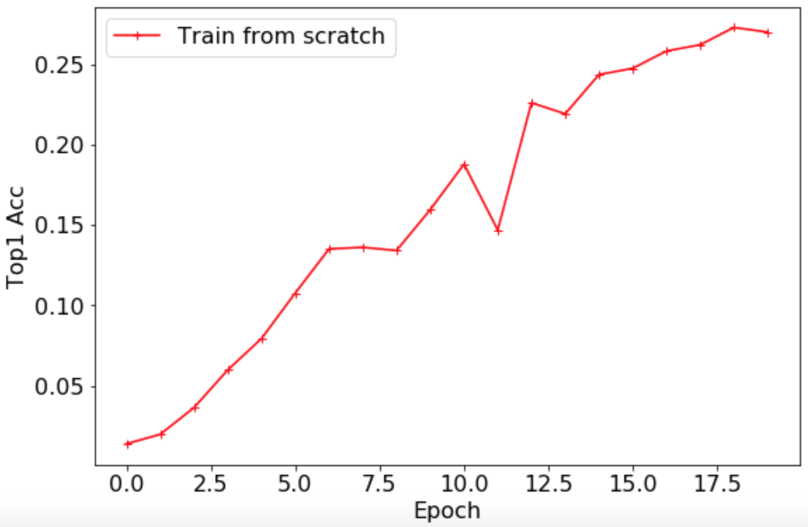

# Trial in 30mins

Based on the flowers102 dataset, it takes only 30 mins to experience PaddleClas, include training varieties of backbone and pretrained model, SSLD distillation, and multiple data augmentation, Please refer to [Installation](install_en.md) to install at first.


## Preparation

* Enter insatallation dir.

```
cd path_to_PaddleClas
```

* Enter `dataset/flowers102`, download and decompress flowers102 dataset.

```shell
cd dataset/flowers102
# If you want to download from the brower, you can copy the link, visit it
# in the browser, download and then decommpress.
wget https://paddle-imagenet-models-name.bj.bcebos.com/data/flowers102.zip
unzip flowers102.zip
```

* Return `PaddleClas` dir

```
cd ../../
```

## Environment

### Download pretrained model

You can use the following commands to downdload the pretrained models.

```bash
mkdir pretrained
cd pretrained
wget https://paddle-imagenet-models-name.bj.bcebos.com/dygraph/ResNet50_vd_pretrained.pdparams
wget https://paddle-imagenet-models-name.bj.bcebos.com/dygraph/ResNet50_vd_ssld_pretrained.pdparams
wget https://paddle-imagenet-models-name.bj.bcebos.com/dygraph/MobileNetV3_large_x1_0_pretrained.pdparams

cd ../
```

**Note**: If you want to download the pretrained models on Windows environment, you can copy the links to the browser and download.


## Training

* All experiments are running on the NVIDIA® Tesla® V100 single card.
* First of all, use the following command to set visible device.

If you use mac or linux, you can use the following command:

```shell
export CUDA_VISIBLE_DEVICES=0
```

* If you use windows, you can use the following command.

```shell
set CUDA_VISIBLE_DEVICES=0
```

* If you want to train on cpu device, you can modify the field `use_gpu: True` in the config file to `use_gpu: False`, or you can append `-o use_gpu=False` in the training command, which means override the value of `use_gpu` as False.


### Train from scratch

* Train ResNet50_vd

```shell
python3 tools/train.py -c ./configs/quick_start/ResNet50_vd.yaml
```

If you want to train on cpu device, the command is as follows.

```shell
python3 tools/train.py -c ./configs/quick_start/ResNet50_vd.yaml -o use_gpu=False
```

Similarly, for the following commands, if you want to train on cpu device, you can append `-o use_gpu=False` in the command.

The validation `Top1 Acc` curve is shown below.




### Finetune - ResNet50_vd pretrained model (Acc 79.12\%)

* Finetune ResNet50_vd model pretrained on the 1000-class Imagenet dataset

```shell
python3 tools/train.py -c ./configs/quick_start/ResNet50_vd_finetune.yaml
```

The validation `Top1 Acc` curve is shown below


Compare with training from scratch, it improve by 65\% to 94.02\%


You can use the trained model to infer the result of image `docs/images/quick_start/flowers102/image_06739.jpg`. The command is as follows.


```shell
python3 tools/infer/infer.py \
    -i docs/images/quick_start/flowers102/image_06739.jpg \
    --model=ResNet50_vd \
    --pretrained_model="output/ResNet50_vd/best_model/ppcls" \
    --class_num=102
```

The output is as follows. Top-5 class ids and their scores are printed.

```
Current image file: docs/images/quick_start/flowers102/image_06739.jpg
    top1, class id: 0, probability: 0.5129
    top2, class id: 50, probability: 0.0671
    top3, class id: 18, probability: 0.0377
    top4, class id: 82, probability: 0.0238
    top5, class id: 54, probability: 0.0231
```

* Note: Results are different for different models, so you might get different results for the command.


### SSLD finetune - ResNet50_vd_ssld pretrained model (Acc 82.39\%)

Note: when finetuning model, which has been trained by SSLD, please use smaller learning rate in the middle of net.

```yaml
ARCHITECTURE:
    name: 'ResNet50_vd'
    params:
        lr_mult_list: [0.5, 0.5, 0.6, 0.6, 0.8]
pretrained_model: "./pretrained/ResNet50_vd_ssld_pretrained"
```

Tringing script

```shell
python3 tools/train.py -c ./configs/quick_start/ResNet50_vd_ssld_finetune.yaml
```

Compare with finetune on the 79.12% pretrained model, it improve by 0.98\% to 95\%.


### More architecture - MobileNetV3

Training script

```shell
python3 tools/train.py -c ./configs/quick_start/MobileNetV3_large_x1_0_finetune.yaml
```

Compare with ResNet50_vd pretrained model, it decrease by 5% to 90%. Different architecture generates different performance, actually it is a task-oriented decision to apply the best performance model, should consider the inference time, storage, heterogeneous device, etc.


### RandomErasing

Data augmentation works when training data is small.

Training script

```shell
python3 tools/train.py -c ./configs/quick_start/ResNet50_vd_ssld_random_erasing_finetune.yaml
```

It improves by 1.27\% to 96.27\%


### Distillation

* The ResNet50_vd model pretrained on previous chapter will be used as the teacher model to train student model. Save the model to specified directory, command as follows:

```shell
cp -r output/ResNet50_vd/19/  ./pretrained/flowers102_R50_vd_final/
```

* Use `extra_list.txt` as unlabeled data, Note:
    * Samples in the `extra_list.txt` and `val_list.txt` don't have intersection
    * Because of in the source code, label information is unused, This is still unlabeled distillation
    * Teacher model use the pretrained_model trained on the flowers102 dataset, and student model use the MobileNetV3_large_x1_0 pretrained model(Acc 75.32\%) trained on the ImageNet1K dataset


```yaml
total_images: 7169
ARCHITECTURE:
    name: 'ResNet50_vd_distill_MobileNetV3_large_x1_0'
pretrained_model:
    - "./pretrained/flowers102_R50_vd_final/ppcls"
    - "./pretrained/MobileNetV3_large_x1_0_pretrained/”
TRAIN:
    file_list: "./dataset/flowers102/train_extra_list.txt"
```

Final training script

```shell
python3 tools/train.py -c ./configs/quick_start/R50_vd_distill_MV3_large_x1_0.yaml
```

It significantly imporve by 6.47% to 96.47% with more unlabeled data and teacher model.

### All accuracy


|Configuration | Top1 Acc |
|- |:-: |
| ResNet50_vd.yaml | 0.2735 |
| MobileNetV3_large_x1_0_finetune.yaml | 0.9000 |
| ResNet50_vd_finetune.yaml | 0.9402 |
| ResNet50_vd_ssld_finetune.yaml | 0.9500 |
| ResNet50_vd_ssld_random_erasing_finetune.yaml | 0.9627 |
| R50_vd_distill_MV3_large_x1_0.yaml | 0.9647 |


The whole accuracy curves are shown below


* **NOTE**: As flowers102 is a small dataset, validatation accuracy maybe float 1%.

* Please refer to [Getting_started](./getting_started_en.md) for more details
