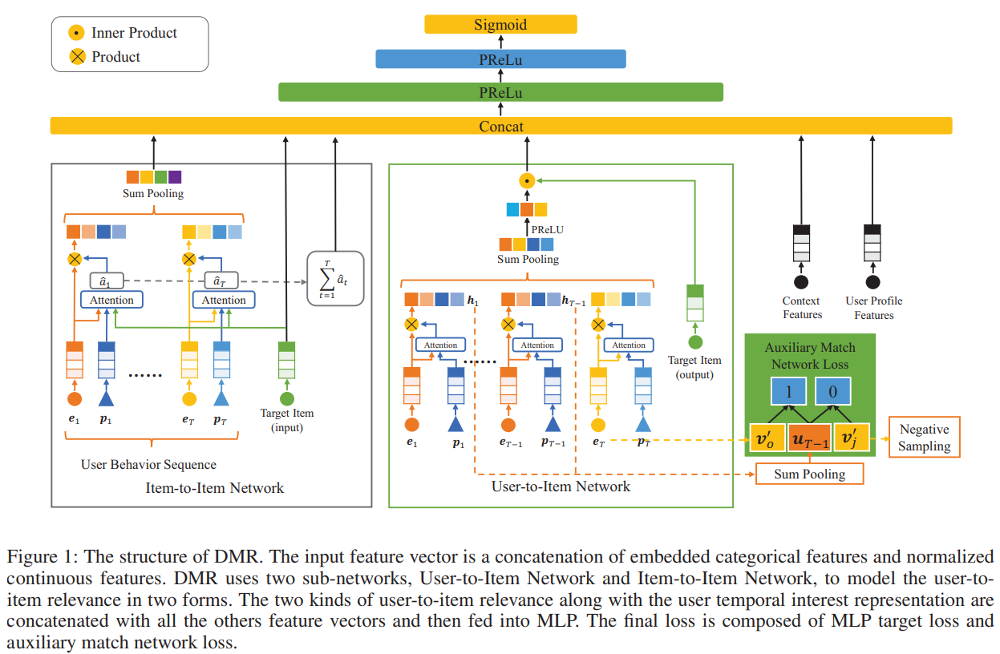

# Deep Match to Rank

* [Deep Match to Rank](#deep-match-to-rank)
   * [一、简介](#一简介)
   * [二、复现精度](#二复现精度)
   * [三、数据集](#三数据集)
   * [四、环境依赖](#四环境依赖)
   * [五、快速开始](#五快速开始)
      * [step 1: 下载代码](#step-1-下载代码)
      * [step 2: 安装依赖](#step-2-安装依赖)
      * [step 3: 修改配置文件](#step-3-修改配置文件)
      * [step 4: 生成训练和评估数据](#step-4-生成训练和评估数据)
      * [step 5: 启动训练](#step-5-启动训练)
      * [step 6: 评估模型](#step-6-评估模型)
   * [六、代码结构与详细说明](#六代码结构与详细说明)
      * [6.1 代码结构](#61-代码结构)
      * [6.2 参数说明](#62-参数说明)
   * [七、模型信息](#七模型信息)


## 一、简介
DMR(Deep Match to Rank Model for Personalized Click-Through Rate Prediction)是阿里巴巴团队发表于AAAI 2020的论文。 文章针对已有CTR预测模型主要关注user表征而忽略了user和item之间相关性表征的问题，提出了用Item-to-Item和User-to-Item两个子网络分别建模user和item之间的相关性，之后再与其他用户兴趣表征拼接到一起输入MLP的方法。公开数据集和私有数据集上的实验结果均表明本方法取得了当时的SOTA效果。



[论文链接](https://ojs.aaai.org//index.php/AAAI/article/view/5346) | [论文源码](https://github.com/lvze92/DMR)

本项目基于PaddlePaddle动态图模式对DMR模型进行了复现。

## 二、复现精度

| 数据集 | 原论文AUC | 复现精度 |
| --- | --- | --- |
| Ad Display/Click Data on Taobao.com | 0.6447 |0.6441|

- 复现参数设置
```
- lr：0.008
- batch_size: 5120
- optimizer：Adam
```
*未尝试更小的学习率，有可能0.006~0.0075会取得更好结果*

## 三、数据集
使用的原始数据集是阿里巴巴提供的一个淘宝展示广告点击率预估数据集。

数据集基本信息如下，更详细的说明请查看[数据集介绍](https://tianchi.aliyun.com/dataset/dataDetail?dataId=56)：

| 数据名称 | 说明 | 属性 |
| --- | --- | --- |
| raw_sample | 原始的样本骨架 | 用户ID，广告ID，时间，资源位，是否点击  |
| ad_feature | 广告的基本信息 | 广告ID，广告计划ID，类目ID，品牌ID |
| user_profile | 用户的基本信息 | 用户ID，年龄层，性别等 |
| raw_behavior_log | 用户的行为日志 | 用户ID，行为类型，时间，商品类目ID，品牌ID |

从淘宝网站中随机抽样了114万用户8天内的广告展示/点击日志（2600万条记录），构成原始的样本骨架。用前面7天的做训练样本（20170506-20170512），用第8天的做测试样本（20170513）。

该数据集需要经过预处理才能成为模型的输入，但原论文及源代码中均未披露详细的数据预处理过程。经过仔细研究源代码和给出的sample数据，本项目作者分析出了数据预处理流程；但对于Price的归一化方法未做严格对齐，这个可能会对模型结果造成细微影响。

```
==> raw_sample.csv <== nonclk,clk对应alimama_sampled.txt最后一列（266），点击与否。用前面7天的做训练样本（20170506-20170512），用第8天的做测试样本（20170513），time_stamp 1494032110 stands for 2017-05-06 08:55:10。pid要编码为类别数字。
user,time_stamp,adgroup_id,pid,nonclk,clk
581738,1494137644,1,430548_1007,1,0

==> behavior_log.csv <== 对应alimama_sampled.txt中[0:150]列（列号从0开始），需要根据raw_sample.csv每行记录查找对应的50条历史数据，btag要编码为类别数字
user,time_stamp,btag,cate,brand
558157,1493741625,pv,6250,91286

==> user_profile.csv <== 对应alimama_sampled.txt中[250:259]列（列号从0开始）
userid,cms_segid,cms_group_id,final_gender_code,age_level,pvalue_level,shopping_level,occupation,new_user_class_level 
234,0,5,2,5,,3,0,3

==> ad_feature.csv <== 对应alimama_sampled.txt中[259:264]列（列号从0开始）,price需要标准化到0~1
adgroup_id,cate_id,campaign_id,customer,brand,price
63133,6406,83237,1,95471,170.0
```

详细的数据预处理流程请查看[AI Studio项目](https://aistudio.baidu.com/aistudio/projectdetail/1805731)，预处理完成的数据集请在[数据集链接](https://aistudio.baidu.com/aistudio/datasetdetail/81892)下载。

当然，本项目中已包含样例数据，在进行全量数据训练之前可以先使用样例数据快速开始。

## 四、环境依赖
- 硬件： 支持PaddlePaddle的任意硬件
- 框架： PaddlePaddle>=2.1.0

*原则上支持PaddlePaddle>=2.0.0，但dygraph_model.py第59行在2.0.2和2.1.0的写法需要有区别，具体见代码中注释，当前启用代码支持2.1.0。*

## 五、快速开始
### step 1: 下载代码
```
git clone https://github.com/PaddlePaddle/Contrib
cd Contrib/DMR
```

### step 2: 安装依赖
CPU环境：
```
pip install -r requirements.txt
```
GPU环境根据CUDA版本进行选择，具体参考[这里](https://www.paddlepaddle.org.cn/install/quick)。

### step 3: 修改配置文件
- 样例数据
根据CPU或GPU环境修改`config/config.yaml`中`use_gpu`为`False`或`True`。

- 全量数据
对应配置文件为`config/config_bigdata.yaml`。

### step 4: 生成训练和评估数据
- 样例数据
```
python -u src/prepare_sample_data.py
```

- 全量数据
需要提前下载[完整数据集](https://aistudio.baidu.com/aistudio/datasetdetail/81892)，并将压缩文件放到`data`目录下。
```
python -u src/prepare_full_data.py
```

### step 5: 启动训练
- 样例数据
```
python -u src/trainer.py -m config/config.yaml
```
- 全量数据
```
python -u src/trainer.py -m config/config_bigdata.yaml
```

### step 6: 评估模型
- 样例数据
```
python -u src/infer.py -m config/config.yaml
```
- 全量数据
```
python -u src/infer.py -m config/config_bigdata.yaml
```

## 六、代码结构与详细说明
### 6.1 代码结构

``` 
├── config					      # 配置文件夹
│   ├── config_bigdata.yaml       # 样例数据集配置文件
│   └── config.yaml               # 全量数据集配置文件
├── data                          # 数据文件夹
│   └── alimama_sampled.txt       # 样例数据文件
├── imgs                          # 图片文件夹
│   └── DMR_structure.png         # 模型结构图 
├── README.md                     # 使用说明
├── requirements.txt              # 依赖文件
└── src                           # 代码文件夹
    ├── alimama_reader.py         # 数据集载入代码
    ├── dygraph_model.py          # 动态图模型构造代码
    ├── infer.py                  # 推理评估代码
    ├── net.py                    # 模型网络结构代码
    ├── prepare_full_data.py      # 全量数据集准备代码
    ├── prepare_sample_data.py    # 样例数据集准备代码
    ├── trainer.py                # 训练代码
    └── utils                     # 工具类代码文件夹
        ├── envs.py               # 环境相关工具代码
        ├── save_load.py          # 模型保存和载入代码
        └── utils_single.py       # 工具类代码
```

### 6.2 参数说明
通过`config/*.yaml`文件设置训练和评估相关参数，具体参数如下：
|  参数   | 默认值  | 说明 |
|  ----  |  ----  |  ----  |
| runner.train_data_dir|"data/sample_data/train"|训练数据所在文件夹|
|runer.train_reader_path|"alimama_reader"|训练数据集载入代码|
|runer.use_gpu|True|是否使用GPU|
|runer.train_batch_size|256|训练时batch_size|
|runer.epochs|1|训练几个epoch|
|runner.print_interval|50|多少个batch打印一次信息|
|runner.model_init_path|"output_model_dmr/0"|继续训练时模型载入目录，默认未启用|
|runner.model_save_path|"output_model_dmr"|模型保存目录|
|runner.test_data_dir|"data/sample_data/test"|测试数据文件夹|
|runner.infer_reader_path| "alimama_reader"|测试数据集载入代码|
|runner.infer_batch_size|256|评估推理时batch_size|
|runner.infer_load_path|"output_model_dmr"|评估推理时模型载入目录|
|runner.infer_start_epoch|1000|评估推理的从哪个epoch开始，默认会把最优模型保存到目录1000，所以默认从1000开始，当然也可以从0开始|
|runner.infer_end_epoch|1001|评估推理到哪个epoch（不含）停止，默认值实际上只评估1000目录中的这1个模型|
|runner.with_label|1|是否有标签，1有0无|
|runner.use_visual|True|是否用visualDL记录训练日志|
|runner.save_checkpoint_interval|1|每几个epoch保存一次模型|
|hyper_parameters.optimizer.class|Adam|优化器，Adam效果最好|
|hyper_parameters.optimizer.learning_rate|0.001|学习率，应与batchsize同步调整|

## 七、模型信息
关于模型的其他信息，可以参考下表：

| 信息 | 说明 |
| --- | --- |
| 发布者 |bnujli |
| 时间 | 2021.07 |
| 框架版本 | Paddle 2.1.0 |
| 应用场景 | 广告点击率预测|
| AUC |  0.6441  |
