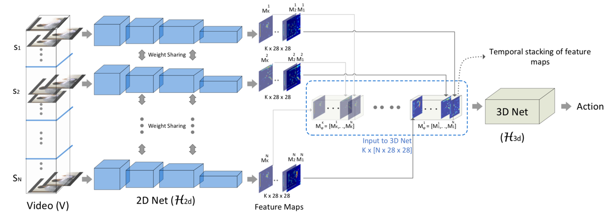

English | [Chinese](README.md)

# ECO Video Action Recognition Model

---
## Contents

- [Introduction](#Introduction)
- [Data](#Data)
- [Train](#Train)
- [Test](#Test)
- [Reference](#Reference)
- [Others](#Others)


## Introduction

ECO involves (i) a 2D pathway, to capture spatial semantics, and (ii) a 3D path-way, to capture temporal resolution.

<p align="center">
 <br />
ECO Overview
</p>

## Data

We use UCF-101 to train this model。

*  Option 1：
Dataset can be downloaded from [UCF-101 dataset](https://www.crcv.ucf.edu/data/UCF101.php)

After saved the dataset to the data folder, you can run the following commands：

```bash
python avi2jpg.py

python jpg2pkl.py

python data_list_gener.py
```
*  Option 2(the recommended way)：

Download the dataset of [jpg images](https://aistudio.baidu.com/aistudio/datasetdetail/52155) which are converted from the original dataset. After unzip，please run the following commands：

```bash
python jpg2pkl.py

python data_list_gener.py
```

## Train

You can start training by such command：

```bash
python train.py --epoch 5 --use_gpu True --pretrain True

```
- Args `-pretrain` is used for training with pretrained model.You can download our trained model for finetuning [Baidu Pan](https://pan.baidu.com/s/1yU3TILs-39CCPWuBD8NqHg) code: h47v


### Training Hardware requirement

*  Nvidia V100(32G)，seg\_num=12, batch\_size=12


## Test

You can start testing by such command：

```bash
python test.py --weights 'trained_model/eco_1_8.pdparams'
```

- Args `--weights`is used for training with the trained model.You can download our trained model for testing [Baidu Pan](https://pan.baidu.com/s/1yU3TILs-39CCPWuBD8NqHg) code: h47v

Test accuracy on UCF-101:

| Acc1 | 
| :---: | 
| 97.57 | 


## Reference

- [ECO: Efficient Convolutional Network for Online Video Understanding](https://arxiv.org/abs/1804.09066), Mohammadreza Zolfaghari, Kamaljeet Singh, Thomas Brox 

## Others

- [AI Studio 项目链接](https://aistudio.baidu.com/aistudio/projectdetail/674555)