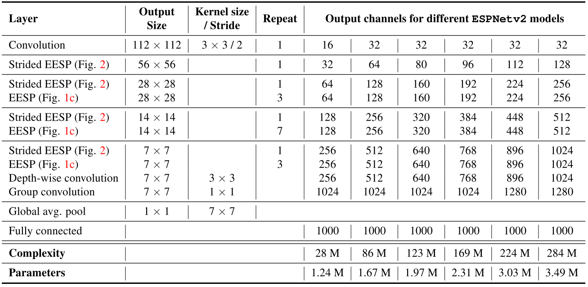

# EspnetV2_paddle


## 1 简介
  
本项目基于paddlepaddle框架复现了ESPNetV2语义分割模型，ESPNetV2利用分组卷积、深度可分离空洞卷积减少模型参数。

**论文：**
- [1] Sachin Mehta, Mohammad Rastegari, Linda Shapiro, and Hannaneh Hajishirzi. [ESPNetv2: A Light-weight, Power Efficient, and General Purpose Convolutional Neural Network](https://arxiv.org/abs/1811.11431)

**项目参考：**
- [https://github.com/sacmehta/ESPNetv2](https://github.com/sacmehta/ESPNetv2)

## 2 复现精度
>在CityScapes val数据集的测试效果如下表。


| |steps|opt|image_size|batch_size|dataset|memory|card|mIou|config|
| :---: | :---: | :---: | :---: | :---: | :---: | :---: | :---: | :---: | :---: |
|ESPNetV2|120k|adam|1024x512|8|CityScapes|32G|4|0.6956|[espnet_cityscapes_1024_512_120k_x2.yml](configs/espnet_cityscapes_1024_512_120k_x2.yml)|

## 3 数据集
[CityScapes dataset](https://www.cityscapes-dataset.com/)

- 数据集大小:
    - 训练集: 2975
    - 验证集: 500

## 4 环境依赖
- 硬件: Tesla V100 * 4

- 框架:
    - PaddlePaddle == develop
  
    
## 快速开始

### 第一步：克隆本项目
```bash
# clone this repo
git clone https://github.com/justld/EspnetV2_paddle.git
cd EspnetV2_paddle
```

**安装第三方库**
```bash
pip install -r requirements.txt
```

### 第二步：计算交叉熵损失的权重
运行compute_classweight.py文件，注意修改文件内的数据路径，将运行打印的输出结果作为配置文件的损失函数权重。

### 第三步：训练模型
单卡训练：
```bash
python train.py --config configs/espnet_cityscapes_1024_512_120k_x2.yml  --do_eval --use_vdl --log_iter 100 --save_interval 1000 --save_dir output
```
多卡训练：
```bash
python -m paddle.distributed.launch train.py --config configs/espnet_cityscapes_1024_512_120k_x2.yml  --do_eval --use_vdl --log_iter 100 --save_interval 1000 --save_dir output
```

### 第四步：测试
output目录下包含已经训练好的模型参数以及对应的日志文件。
```bash
python val.py --config configs/espnet_cityscapes_1024_512_120k_x2.yml --model_path output/scale_x2/best_model/model.pdparams
```

## 6 代码结构与说明
**代码结构**
```
├─configs                          
├─images                         
├─output                           
├─paddleseg                                                   
│  export.py                     
│  predict.py                        
│  README.md                        
│  README_CN.md                     
│  requirements.txt                      
│  setup.py                   
│  train.py                
│  val.py                       
```
**说明**
1、本项目在Aistudio平台，使用Tesla V100 * 4 脚本任务训练120K miou达到69.56%。
2、本项目基于PaddleSeg开发。

## 7 模型信息

相关信息:

| 信息 | 描述 |
| --- | --- |
| 作者 | 郎督|
| 日期 | 2021年9月 |
| 框架版本 | Paddle develop |
| 应用场景 | 语义分割 |
| 硬件支持 | GPU、CPU |
| 在线体验 | [notebook](https://aistudio.baidu.com/aistudio/projectdetail/2268710?contributionType=1), [Script](https://aistudio.baidu.com/aistudio/clusterprojectdetail/2388364)|


