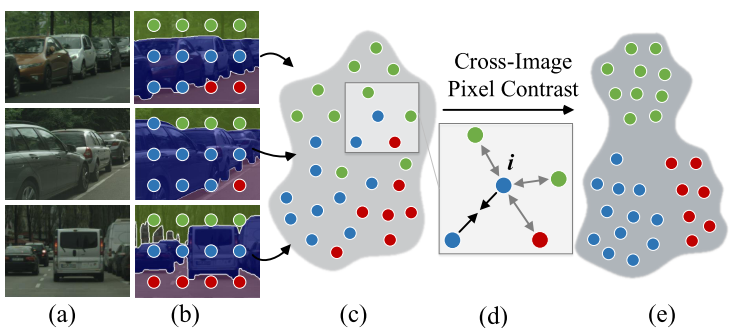

# contrast_seg_paddle  

English | [简体中文](./README_CN.md)

## 1 Introduction
  
This project reproduces HRNet_W48_Contrast based on paddlepaddle framework. The core idea of pixel-wise contrastive algorithm is to force pixel embeddings belonging to a same semantic class to be more similar than embeddings from different classes. It has two advantages. Firstly, pixel-wise contrastive algorithm can address the categorization ability of individual pixel embeddings. Secondly, pixel embeddings be well structured to addrress intra-class compactness and inter-class dispersion.


**Paper:**
- [1] Wenguan Wang, Tianfei Zhou, Fisher Yu , Jifeng Dai, Ender Konukoglu, Luc Van Gool. [Exploring Cross-Image Pixel Contrast for Semantic Segmentation](https://arxiv.org/abs/2101.11939)


**Reference project:**
- [https://github.com/tfzhou/ContrastiveSeg](https://github.com/tfzhou/ContrastiveSeg)

## 2 Accuracy

>This index is test in the val set of CityScapes. HRNet_W48 was pretrained in ImageNet.


| |steps|opt|image_size|batch_size|dataset|memory|card|mIou|config|
| :---: | :---: | :---: | :---: | :---: | :---: | :---: | :---: | :---: | :---: |
|HRNet_W48_contrast|60k|sgd|1024x512|2|CityScapes|32G|4|0.8266|[HRNet_W48_cityscapes_1024x512_60k.yml](configs/HRNet_W48_cityscapes_1024x512_60k)|

## 3 Dataset
[CityScapes dataset](https://www.cityscapes-dataset.com/)

- Dataset size:
    - train: 2975
    - val: 500

## 4 Environment

- Hardware: Tesla V100 * 4

- Framework:
    - PaddlePaddle == 2.1.2
    
## 5 Quick start

### step1: clone 
```bash
# clone this repo
git clone https://github.com/justld/contrast_seg_paddle.git
cd contrast_seg_paddle
```

**Install packages**
```bash
pip install -r requirements.txt
```

### step2: train
```bash
python train.py --config configs/HRNet_W48_cityscapes_1024x512_60k.yml  --do_eval --use_vdl --log_iter 100 --save_interval 1000 --save_dir output
```
If you want to train distributed and use multicards:
```bash
python -m paddle.distributed.launch train.py --config configs/HRNet_W48_cityscapes_1024x512_60k.yml  --do_eval --use_vdl --log_iter 100 --save_interval 1000 --save_dir output
```

### step3: test
You can download the pretrained model in [BaiduYun](https://pan.baidu.com/s/1JiWDSGUOczS4WLDGINN3vg). (Extraction code: hwq7)
```bash
python val.py --config configs/HRNet_W48_cityscapes_1024x512_60k.yml --model_path output/best_model/model.pdparams
```

## 6 Code structure
Structure
```
├─configs                          
├─images                         
├─output                           
├─paddleseg                                                   
│  export.py                     
│  predict.py                        
│  README.md                        
│  README_CN.md                     
│  requirements.txt                      
│  setup.py                   
│  train.py                
│  val.py                       
```

## 7 Model information

For other information about the model, please refer to the following table:

| information | description |
| --- | --- |
| Author | du lang|
| Date | 2021.09 |
| Framework version | Paddle 2.1.2 |
| Application scenarios | Semantic Segmentation |
| Support hardware | GPU、CPU |
| Online operation | [notebook](https://aistudio.baidu.com/aistudio/projectdetail/2362799), [Script](https://aistudio.baidu.com/aistudio/clusterprojectdetail/2339905)|


