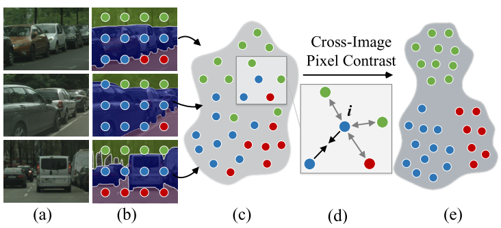

# contrast_seg_paddle  

[English](./README.md) | 简体中文

## 1 简介
  
本项目基于paddlepaddle框架复现了HRNet_W48_Contrast模型。跨图像像素对比算法的核心思想是使属于同一类别的像素嵌入空间相似性更高，不同像素嵌入空间相似性较低。

**论文：**
- [1] Wenguan Wang, Tianfei Zhou, Fisher Yu , Jifeng Dai, Ender Konukoglu, Luc Van Gool. [Exploring Cross-Image Pixel Contrast for Semantic Segmentation](https://arxiv.org/abs/2101.11939)

**项目参考：**
- [https://github.com/tfzhou/ContrastiveSeg](https://github.com/tfzhou/ContrastiveSeg)

## 2 复现精度
>在CityScapes val数据集的测试效果如下表，其中HRNet_W48在ImageNet预训练。


| |steps|opt|image_size|batch_size|dataset|memory|card|mIou|config|
| :---: | :---: | :---: | :---: | :---: | :---: | :---: | :---: | :---: | :---: |
|HRNet_W48_contrast|60k|sgd|1024x512|2|CityScapes|32G|4|0.8266|[HRNet_W48_cityscapes_1024x512_60k.yml](configs/HRNet_W48_cityscapes_1024x512_60k)|

## 3 数据集
[CityScapes dataset](https://www.cityscapes-dataset.com/)

- 数据集大小:
    - 训练集: 2975
    - 验证集: 500

## 4 环境依赖
- 硬件: Tesla V100 * 4

- 框架:
    - PaddlePaddle == 2.1.2
    
## 快速开始

### 第一步：克隆本项目
```bash
# clone this repo
git clone https://github.com/justld/contrast_seg_paddle.git
cd contrast_seg_paddle
```

**安装第三方库**
```bash
pip install -r requirements.txt
```

### 第二步：训练模型
单卡训练：
```bash
python train.py --config configs/HRNet_W48_cityscapes_1024x512_60k.yml  --do_eval --use_vdl --log_iter 100 --save_interval 1000 --save_dir output
```
多卡训练：
```bash
python -m paddle.distributed.launch train.py --config configs/HRNet_W48_cityscapes_1024x512_60k.yml  --do_eval --use_vdl --log_iter 100 --save_interval 1000 --save_dir output
```

### 第三步：测试
在[百度云](https://pan.baidu.com/s/1JiWDSGUOczS4WLDGINN3vg) (提取码: hwq7)下载预训练模型，放入output/best_model文件夹。
```bash
python val.py --config configs/HRNet_W48_cityscapes_1024x512_60k.yml --model_path output/best_model/model.pdparams
```

## 6 代码结构与说明
**代码结构**
```
├─configs                          
├─images                         
├─output                           
├─paddleseg                                                   
│  export.py                     
│  predict.py                        
│  README.md                        
│  README_CN.md                     
│  requirements.txt                      
│  setup.py                   
│  train.py                
│  val.py                       
```
**说明**
1、本项目在Aistudio平台，使用Tesla V100 * 4 脚本任务训练60K miou达到82.66%。
2、本项目基于PaddleSeg开发。

## 7 模型信息

相关信息:

| 信息 | 描述 |
| --- | --- |
| 作者 | 郎督|
| 日期 | 2021年9月 |
| 框架版本 | Paddle 2.1.2 |
| 应用场景 | 语义分割 |
| 硬件支持 | GPU、CPU |
| 在线体验 | [notebook](https://aistudio.baidu.com/aistudio/projectdetail/2362799), [Script](https://aistudio.baidu.com/aistudio/clusterprojectdetail/2339905)|

