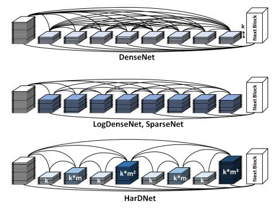

# HarDNet

[English](./README.md) | 简体中文
   
   * [HarDNet](#HarDNet)
      * [一、简介](#一简介)
      * [二、复现精度](#二复现精度)
      * [三、数据集](#三数据集)
      * [四、环境依赖](#四环境依赖)
      * [五、快速开始](#五快速开始)
         * [step1: clone](#step1-clone)
         * [step2: 训练](#step2-训练)
         * [step3: 测试](#step3-测试)
      * [六、代码结构与详细说明](#六代码结构与详细说明)
         * [6.1 代码结构](#61-代码结构)
         * [6.2 参数说明](#62-参数说明)
         * [6.3 训练流程](#63-训练流程)
            * [单机训练](#单机训练)
            * [多机训练](#多机训练)
         * [6.4 评估流程](#64-评估流程)
      * [七、模型信息](#七模型信息)

## 一、简介



HarDNet(Harmonic DenseNet: A low memory traffic network)是轻量型模型的一种，其突出的特点就是低内存占用率，作者通过对DenseNet进行深入分析后提出了一些提升模型计算效率的结构及操作，从而得到HarDNet结构。

**论文:**[Harmonic DenseNet: A low memory traffic network](https://arxiv.org/abs/1909.00948)

## 二、复现精度（HarDNet68）

下表中是飞浆论文复现赛中提交的结果，超参等配置完全贴合论文原始配置。我们不光实现了HarDNet60，还实现了HarDNet85, HarDNet68ds, HarDNet39ds等多个版本代码

| 指标 | 原论文 | 复现精度 | log/model |
| --- | --- | --- | --- |
| top-1 err | 23.8 | 24.122 | [百度云提取码i88v](https://pan.baidu.com/s/1Q9Vc_V6SBSmj3OclClbNlQ) |
| top-5 err | /  | 7.282 |  |

## 三、数据集

使用的数据集为：[ImageNet2012](https://www.image-net.org)。

- 数据集大小：1000个类别，128W张常规的自然图像
  - 训练集：128W张图像
  - 验证集：5W张图像
  - 测试集：10W张图像
- 数据格式：图片后缀以.JPEG结尾

## 四、环境依赖

- 硬件：GPU、CPU

- 框架：
  - PaddlePaddle >= 2.0.0

## 五、快速开始

### step1: clone 
本项目基于[PaddleClas](https://github.com/PaddlePaddle/PaddleClas)开发，更具体的应该说是基于该项目的[release/2.0](https://github.com/PaddlePaddle/PaddleClas/tree/release/2.0)分支开发完成

``` bash
# clone this repo
git clone https://github.com/PaddlePaddle/Contrib
cd Contrib/HarDNet
```

### step2: 训练
```python
CUDA_VISIBLE_DEVICES=0,1,2,3 python -m paddle.distributed.launch \
                            --gpus="0,1,2,3" tools/train.py -c ./configs/HarDNet/HarDNet68_best_v2.yaml
```
or
```bash
bash run_train_hardnet68_best.sh
```

此时的输出为：
```bash
2021-04-21 10:26:32 INFO: epoch:0  , train step:0   , top1: 0.00000, top5: 0.00000, loss: 7.02515, lr: 0.050000, batch_cost: 1.81843 s, reader_cost: 1.35717 s, ips: 35.19526 images/sec.
2021-04-21 10:26:35 INFO: epoch:0  , train step:10  , top1: 0.00000, top5: 0.00000, loss: 7.20494, lr: 0.050000, batch_cost: 0.26383 s, reader_cost: 0.00370 s, ips: 242.58488 images/sec.
2021-04-21 10:26:37 INFO: epoch:0  , train step:20  , top1: 0.00000, top5: 0.01562, loss: 7.15727, lr: 0.050000, batch_cost: 0.26172 s, reader_cost: 0.00150 s, ips: 244.54005 images/sec.
```
由于是分类任务，需要关注 ``loss`` 逐渐降低，``acc1、acc5`` (TOP1准确率，TOP5准确率)逐渐升高。

### step3: 测试
```python
CUDA_VISIBLE_DEVICES=0 python tools/eval.py \
                        -c ./configs/HarDNet/HarDNet68_best_v2.yaml \
                        -o pretrained_model='output/HarDNet68_v2/HarDNet68/best_model/ppcls' \
                        -o load_static_weights=False
```
or
```bash
bash run_test_hardnet68_best.sh
```

此时的输出为（截取了log的末尾，包含性能分）：
```bash
2021-04-25 10:31:58 INFO: epoch:0  , valid step:700 , top1: 0.68750, top5: 0.84375, loss: 1.57983, lr: 0.000000, batch_cost: 0.15689 s, reader_cost: 0.10968 s, ips: 407.93717 images/sec.
2021-04-25 10:31:59 INFO: epoch:0  , valid step:710 , top1: 0.78125, top5: 0.92188, loss: 0.90177, lr: 0.000000, batch_cost: 0.15652 s, reader_cost: 0.10931 s, ips: 408.88116 images/sec.
2021-04-25 10:32:01 INFO: epoch:0  , valid step:720 , top1: 0.75000, top5: 0.92188, loss: 1.14443, lr: 0.000000, batch_cost: 0.15643 s, reader_cost: 0.10922 s, ips: 409.13469 images/sec.
2021-04-25 10:32:02 INFO: epoch:0  , valid step:730 , top1: 0.70312, top5: 0.87500, loss: 1.35381, lr: 0.000000, batch_cost: 0.15582 s, reader_cost: 0.10860 s, ips: 410.73628 images/sec.
2021-04-25 10:32:04 INFO: epoch:0  , valid step:740 , top1: 0.68750, top5: 0.90625, loss: 1.07249, lr: 0.000000, batch_cost: 0.15634 s, reader_cost: 0.10912 s, ips: 409.36760 images/sec.
2021-04-25 10:32:05 INFO: epoch:0  , valid step:750 , top1: 0.70312, top5: 0.90625, loss: 1.13726, lr: 0.000000, batch_cost: 0.15600 s, reader_cost: 0.10879 s, ips: 410.24547 images/sec.
2021-04-25 10:32:07 INFO: epoch:0  , valid step:760 , top1: 0.81250, top5: 0.96875, loss: 0.73756, lr: 0.000000, batch_cost: 0.15686 s, reader_cost: 0.10965 s, ips: 408.00934 images/sec.
2021-04-25 10:32:09 INFO: epoch:0  , valid step:770 , top1: 0.70312, top5: 0.89062, loss: 1.39002, lr: 0.000000, batch_cost: 0.15706 s, reader_cost: 0.10984 s, ips: 407.49654 images/sec.
2021-04-25 10:32:11 INFO: epoch:0  , valid step:780 , top1: 0.70312, top5: 0.90625, loss: 1.10168, lr: 0.000000, batch_cost: 0.15720 s, reader_cost: 0.10999 s, ips: 407.12636 images/sec.
2021-04-25 10:32:11 INFO: END epoch:0   valid top1: 0.75878, top5: 0.92718, loss: 0.96913,  batch_cost: 0.15702 s, reader_cost: 0.10984 s, batch_cost_sum: 121.21882 s, ips: 101.89837 images/sec.
```

## 六、代码结构与详细说明

### 6.1 代码结构

详情参考[docs](https://github.com/PaddlePaddle/PaddleClas/tree/release/2.0/docs/en/tutorials/getting_started_en.md)

### 6.2 参数说明

可以在 `configs/xxx.yaml` 中设置训练与评估相关参数，具体如下：

| name | detail | default value | optional value |
|:---:|:---:|:---:|:---:|
| mode | mode | "train" | ["train"," valid"] |
| checkpoints | checkpoint model path for resuming training process | "" | Str |
| last_epoch | last epoch for the training，used with checkpoints | -1 | int |
| pretrained_model | pretrained model path | "" | Str |
| load_static_weights | whether the pretrained model is saved in static mode | False | bool |
| model_save_dir | model stored path | "" | Str |
| classes_num | class number | 1000 | int |
| total_images | total images | 1281167 | int |
| save_interval | save interval | 1 | int |
| validate | whether to validate when training | TRUE | bool |
| valid_interval | valid interval | 1 | int |
| epochs | epoch |  | int |
| topk | K value | 5 | int |
| image_shape | image size | [3，224，224] | list, shape: (3,) |
| use_mix | whether to use mixup | False | ['True', 'False'] |
| ls_epsilon | label_smoothing epsilon value| 0 | float |
| use_distillation | whether to use SSLD distillation training | False | bool |

更多的配置相关信息请参考[config_en.md](https://github.com/PaddlePaddle/PaddleClas/tree/release/2.0/docs/en/tutorials/config_en.md)

### 6.3 训练流程

#### 单机训练
```python
python tools/train.py -c ./configs/HarDNet/HarDNet68_best_v2.yaml
```

#### 多机训练
```python
CUDA_VISIBLE_DEVICES=0,1,2,3 python -m paddle.distributed.launch \
                            --gpus="0,1,2,3" tools/train.py -c ./configs/HarDNet/HarDNet68_best_v2.yaml
```

此时，程序会将每个进程的输出log导入到`./log`路径下：
```
.
├── log
│   ├── workerlog.0
│   ├── workerlog.1
│   ├── workerlog.2
│   └── workerlog.3
├── README.md
└── train.py
```

### 6.4 评估流程

```python
CUDA_VISIBLE_DEVICES=0 python tools/eval.py \
                        -c ./configs/HarDNet/HarDNet68_best_v2.yaml \
                        -o pretrained_model='output/HarDNet68_v2/HarDNet68/best_model/ppcls' \
                        -o load_static_weights=False
```

此时的输出为：
```
2021-04-25 10:32:05 INFO: epoch:0  , valid step:750 , top1: 0.70312, top5: 0.90625, loss: 1.13726, lr: 0.000000, batch_cost: 0.15600 s, reader_cost: 0.10879 s, ips: 410.24547 images/sec.
2021-04-25 10:32:07 INFO: epoch:0  , valid step:760 , top1: 0.81250, top5: 0.96875, loss: 0.73756, lr: 0.000000, batch_cost: 0.15686 s, reader_cost: 0.10965 s, ips: 408.00934 images/sec.
2021-04-25 10:32:09 INFO: epoch:0  , valid step:770 , top1: 0.70312, top5: 0.89062, loss: 1.39002, lr: 0.000000, batch_cost: 0.15706 s, reader_cost: 0.10984 s, ips: 407.49654 images/sec.
2021-04-25 10:32:11 INFO: epoch:0  , valid step:780 , top1: 0.70312, top5: 0.90625, loss: 1.10168, lr: 0.000000, batch_cost: 0.15720 s, reader_cost: 0.10999 s, ips: 407.12636 images/sec.
2021-04-25 10:32:11 INFO: END epoch:0   valid top1: 0.75878, top5: 0.92718, loss: 0.96913,  batch_cost: 0.15702 s, reader_cost: 0.10984 s, batch_cost_sum: 121.21882 s, ips: 101.89837 images/sec.
```

## 七、模型信息

关于模型的其他信息，可以参考下表：

| 信息 | 说明 |
| --- | --- |
| 发布者 | PaddlePaddle |
| 时间 | 2021.06 |
| 框架版本 | Paddle 2.0.1 |
| 应用场景 | 图像分类 |
| 支持硬件 | GPU、CPU |
| TOP-1 Error |  24.122  |
| TOP-5 Error |  7.282   |
| 下载链接 | [预训练模型\训练日志(提取码i88v)](https://pan.baidu.com/s/1Q9Vc_V6SBSmj3OclClbNlQ)
| 模型源代码 | [HarDNet](./ppcls/modeling/architectures/hardnet.py) |
