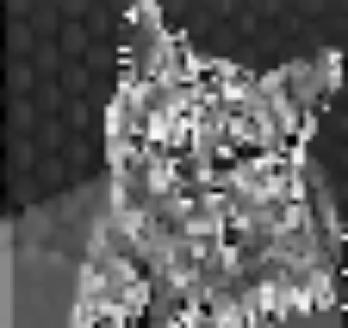

# 特征图可视化指南

## 一、概述

特征图是输入图片在卷积网络中的特征表达，对特征图的研究可以有利于我们对于模型的理解与设计，所以基于动态图我们使用本工具来可视化特征图。

## 二、准备工作

首先需要选定研究的模型，本文设定ResNet50作为研究模型，将resnet.py从[模型库](../../../ppcls/modeling/architecture/)拷贝到当前目录下，并下载预训练模型[预训练模型](../../zh_CN/models/models_intro), 复制resnet50的模型链接，使用下列命令下载并解压预训练模型。

```bash
wget The Link for Pretrained Model
tar -xf Downloaded Pretrained Model
```

以resnet50为例：
```bash
wget https://paddle-imagenet-models-name.bj.bcebos.com/ResNet50_pretrained.tar
tar -xf ResNet50_pretrained.tar
```

## 三、修改模型

找到我们所需要的特征图位置，设置self.fm将其fetch出来，本文以resnet50中的stem层之后的特征图为例。

在fm_vis.py中修改模型的名字。

在ResNet50的__init__函数中定义self.fm
```python
self.fm = None
```
在ResNet50的forward函数中指定特征图
```python
def forward(self, inputs):
    y = self.conv(inputs)
    self.fm = y
    y = self.pool2d_max(y)
    for bottleneck_block in self.bottleneck_block_list:
        y = bottleneck_block(y)
    y = self.pool2d_avg(y)
    y = fluid.layers.reshape(y, shape=[-1, self.pool2d_avg_output])
    y = self.out(y)
    return y, self.fm
```
执行函数
```bash
python tools/feature_maps_visualization/fm_vis.py -i the image you want to test \
                                                -c channel_num -p pretrained model \
                                                --show whether to show \
                                                --interpolation interpolation method\
                                                --save_path where to save \
                                                --use_gpu whether to use gpu
```
参数说明：
+ `-i`：待预测的图片文件路径，如 `./test.jpeg`
+ `-c`：特征图维度，如 `./resnet50_vd/model`
+ `-p`：权重文件路径，如 `./ResNet50_pretrained/`
+ `--interpolation`: 图像插值方式， 默认值 1
+ `--save_path`：保存路径，如：`./tools/`
+ `--use_gpu`：是否使用 GPU 预测，默认值：True

## 四、结果

* 输入图片：  


* 运行下面的特征图可视化脚本

```
python tools/feature_maps_visualization/fm_vis.py \
    -i ./docs/images/feature_maps/feature_visualization_input.jpg \
    -c 5 \
    -p pretrained/ResNet50_pretrained/  \
    --show=True \
    --interpolation=1 \
    --save_path="./output.png" \
    --use_gpu=False \
    --load_static_weights=True
```

* 输出特征图保存为`output.png`，如下所示。


