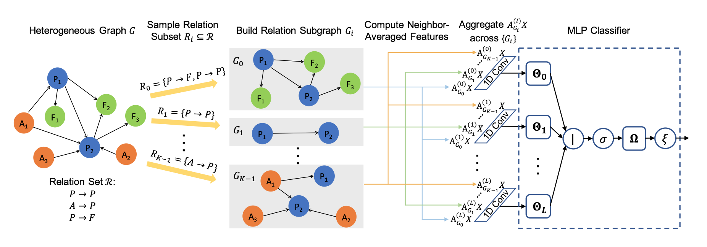

# NARS
## 一、简介
NARS(Neighbor Averaging over Relation Subgraphs)由Facebook研究院的Lingfan Yu等四名华人提出了关系子图上的邻居平均法（NARS），它在随机抽样的关系子图的邻居平均特征上训练一个分类器。我们描述了一些优化措施，以使这些节点特征集在训练和推理时都能以高效的记忆方式计算出来。NARS在OAG、ACM、OGBN-MAG等几个基准数据集上达到了新的技术水平，超过了更昂贵的基于GNN的方法。

**论文:**[Scalable Graph Neural Networks for Heterogeneous Graphs](https://arxiv.org/abs/2011.09679)
## 二、复现精度
| 准确率 | 原论文 | 复现精度 |
| --- | --- | --- |
| OGBN-MAG | 0.5240±0.0016 |0.5240|

## 三、数据集
使用的数据集为：[OGBN-MAG](https://ogb.stanford.edu/docs/home/)。
包含不同的节点类型(论文、作者、机构和主题)及其关系。
它包含四种类型，论文(736,389个节点)，作者(1,134,649个节点)，机构(8,740个节点)和研究领域(59,965个节点)，以及4种关系--一个作者"附属于"一个机构，一个作者"写"一篇论文，一篇论文"引用"一篇论文，一篇论文"的主题是"一个研究领域"。每篇论文由一个128的向量构成。
测试的任务是根据论文的内容、参考文献、作者和作者所属的机构来预测每篇论文的发表会议，共有349个会议。
分割通过年份分割，2018年之前的用于训练，2018和2019年的用于验证和测试
数据格式：使用飞桨框架内置Flowers数据集，默认格式为numpy.array，更多信息请参考[OGBN-MAG安装说明](https://ogb.stanford.edu/docs/home/)
## 四、环境依赖
硬件：XPU、GPU、CPU
框架：PaddlePaddle>=2.0.1
## 五、快速开始
### step1: clone 

``` bash
# clone this repo
 https://github.com/PaddlePaddle/Contrib
cd Contrib/NARS
```
### step2: 训练
``` bash
# 训练
python train.py
```

此时的输出为：
```
loss:3.458: 100%|███████████████████████████████████████████████| 126/126 [40:24<00:00, 19.24s/it]
2021-07-03 18:34:00,407 - INFO - Epoch 1, Times(s): 5060.8278, Accuracy: Train 0.3318, Val 0.3323
```
由于是分类任务，需要关注 ``loss`` 逐渐降低，``Trian训练集准确率、Val验证集准确率`` 逐渐升高。

## 六、代码结构与详细说明

### 6.1 代码结构

```
|-- data                          # 数据文件夹
    |-- label.npy                 # label标签
    |-- num_classes.npy           # 类别数目
    |-- test_nid.npy              # 测试集id
    |-- train_nid.npy             # 训练集id
    |-- val_nid.npy               # 验证集id
|-- sample                        # 样本关系子集
    |-- 8_mag_rand_subsets        # 样本关系子集
|-- model                         # 模型实现文件夹
    |-- model.py                  # 模型实现文件
|-- utils                         # 工具类API文件夹
    |-- utils.py                  # 工具类API文件
|-- README.md                     # 用户手册
|- train.py                       # 执行训练功能的代码
|-- log.txt                       # 训练日志
```

### 6.2 参数说明

可以在 `train.py` 中设置训练与评估相关参数，具体如下：

|  参数   | 默认值  | 说明 | 
|  ----  |  ----  |  ----  | 
| num-epochs  | 1500 | epoch次数 |
| num-hidden | 512 | 隐藏层数量 |
| R  | 5 | hops的数量|
| lr | 0.001 | 学习率 |
| dataset | ogb | 数据集名称 |
| num-hidden | 512 | 隐藏层数量 |
| data-dir  | None | 仅OAG数据集使用 |
| dropout | 0.5| 损失率 |
| gpu | 1| GPU编号 |
| weight-decay | 0 | 权重衰减率 |
| eval-every  | 10| 多少轮验证一次模型 |
| batch-size | 5000 | batch大小 |
| eval-batch-size  | 5000 | 验证批大小 |
| ff-layer | 2 | 前馈层数目 |
| input-dropout | store_true | 输入层损失 |
| seed | None  | 随机种子 |
| cpu-preprocess |store_true| cpu运行|

## 七、模型信息
关于模型的其他信息，可以参考下表：

| 信息 | 说明 |
| --- | --- |
| 发布者 |白马非马 |
| 时间 | 2021.07 |
| 框架版本 | Paddle 2.0.1 |
| 应用场景 | 图神经网络|
| 支持硬件 | XPU、GPU、CPU |
| Accuracy |  0.5240  |


