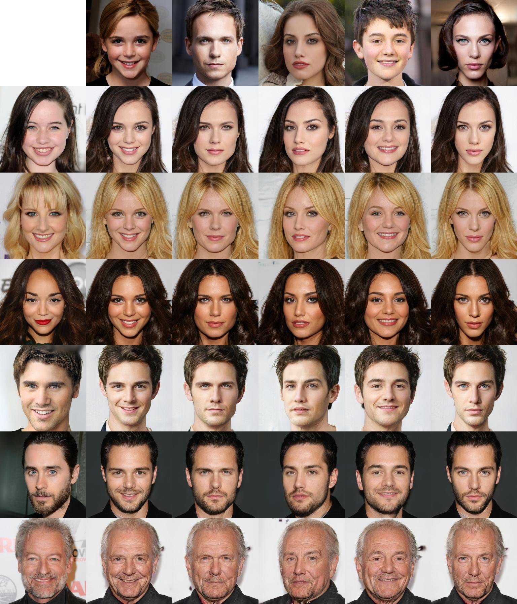
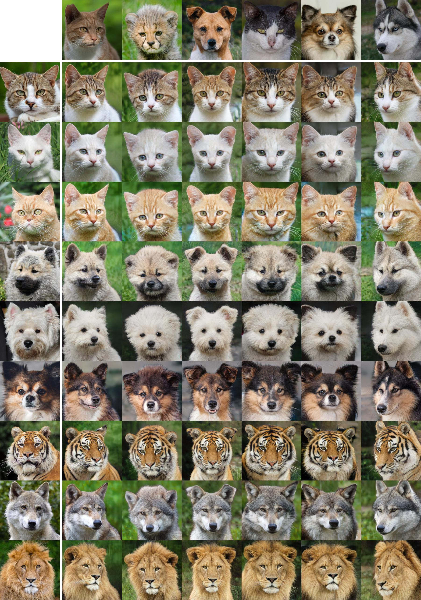

## Requirements
* `paddlepaddle-gpu`
* `opencv-python`
* `Pillow`
* `tqdm`

## Usage
```
├── dataset
   └── YOUR_DATASET_NAME
       ├── train
           ├── domain1 (domain folder)
               ├── xxx.jpg (domain1 image)
               ├── yyy.png
               ├── ...
           ├── domain2
               ├── aaa.jpg (domain2 image)
               ├── bbb.png
               ├── ...
           ├── ...
           
       ├── test
           ├── ref_imgs (domain folder)
               ├── domain1 (domain folder)
                   ├── ttt.jpg (domain1 image)
                   ├── aaa.png
                   ├── ...
               ├── domain2
                   ├── kkk.jpg (domain2 image)
                   ├── iii.png
                   ├── ...
               ├── ...
               
           ├── src_imgs
               ├── src1.jpg 
               ├── src2.png
               ├── ...
```

### Train
```
python main.py --dataset YOUR_DATASET_NAME --phase train
```

### Test
```
python main.py --dataset YOUR_DATASET_NAME --phase test
```

### Val
```
python main.py --dataset YOUR_DATASET_NAME --phase val
```
will gennerate picture fron latent code  at ./result/
put the all file to torch version /expr/results/YOUR_DATASET_NAME/
run eval to get .json result

### Latent-guided synthesis
#### CelebA-HQ


#### AFHQ


### Reference-guided synthesis
#### CelebA-HQ


#### AFHQ




