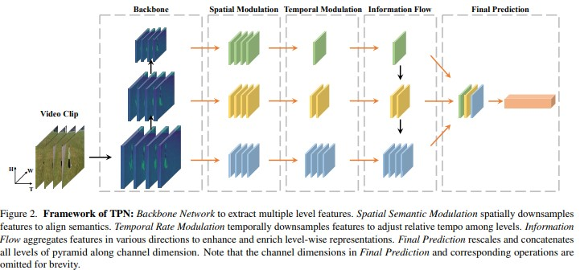

# Temporal Pyramid Network for Action Recognition  静态图实现

## 内容

- [TOC]

  

## 模型简介

<p align="center">
 <br />
    <font color='gray'>框架示意图</font>
</p>

简要说明：
1. TPN网络将多层（从浅层到深层）深度特征进行融合来提高最终的识别正确率，可以认为是FPN网络在视频分类领域的扩展；
2. 在进行特征融合，需要对各层特征进行对齐，包括空域和时域两个维度的对齐；
3. 特征融合时采用了top-down和down-top两个方向的融合，再将两个信息流的输出连接在一起作为最终融合的特征向量。

## 代码结构
```
src
├── configs                      #训练配置文件路径
│   ├── tpn_kinetics400.txt
├── data                         #数据集
|   ├── kinetics400
│   	├── kinetics400_label.txt
│  		├── trainlist.txt
│  		├── vallist.txt
├── log                          #日志保存目录
├── checkpoints                  #训练中间结果保存目录
├── pretrain                     #预训练模型保存目录
|   ├── resnet_50_pretrained
├── config.py                     #训练配置文件读取
├── reader.py                   #数据集读取
├── eval.py   					#测试脚本
├── utils.py     
├── model                      #网络架构类
│   ├── backbone.py
│   ├── TPN.py
│   ├── TSN3D.py
| 
└── train.py                    #训练脚本
```


## 数据准备
kinetics400:https://aistudio.baidu.com/aistudio/datasetdetail/49371


- 数据集每次使用前需要解压缩，解压缩的路径要与data 目录下的文件中规定的路径相符
- 原始数据集中约有几十个视频无法读取，已经从trainlist.txt和vallist.txt中删除
- 验证和测试集使用相同的数据（val_256）

**数据集路径结构**

```
dataset
├── train_256
└── val_256
   
```

## 模型训练:

**预训练模型**：

​	在kinetics上训练的tsn版本的resnet50，

​	下载地址：'https://paddlemodels.bj.bcebos.com/video_classification/ResNet50_pretrained.tar.gz

**图像预处理方式**：

​	首先将视频短边缩放到256，然后随机裁剪224×224区域进行训练，使用随机翻转的增强方式。

**模型配置参数：**

​    r50f8s8

**训练参数**：

  初始学习率lr=0.01，在第27个epoch后降为0.001，总共训练了47个epoch

  batchsize=128（如果选择其它模型配置参数，消耗显存会变大，batchsize必需相应减小）

**运行环境：**

​    硬件：aistudio 提供的8 GPU卡环境 ； 软件：paddlepaddle 1.7.2

**训练入口：**

```bash
train.py 
```

- 直接将train.py设置为主文件运行

- config:训练过程中的学习率、batchsize等参数直接在configs/tpn_kinetics400.txt中设置

- 一共训练了47个eopch，具体训练日志参考log下保存的日志

**训练时的验证：**

​       在训练时每训练完一个epoch就在验证集上进行验证。与训练时类似，仅采样一个clip采用中心裁剪的方式进行验证，由于采样数量少，验证精度比测试精度要低6个百分点左右。

## 模型测试

**测试方法：**

​        采用论文中的方法，先将视频帧短边缩放到256，然后使用3-crop的方法裁剪3个256×256的patch覆盖长边，    每段视频均匀采样10 segnum，即一段视频产生30个样本，将30个样本的预测值进行平均作为整段视频的预测值。

**测试入口：**  

```
eavl.py
```

- 直接将eval.py设置为主文件运行
- config:测试过程中的分段数目，图像大小等参数直接在configs/tpn_kinetics400.txt中设置

## 复现精度

| Model   | Top1  |
| ------- | ----- |
| r50f8s8 | 0.731 |

具体测试过程参考我的工程中log/eval_1014.txt


## 参考论文

```
https://arxiv.org/abs/2004.03548
（论文内附原项目链接）
```

## aistudio项目链接

https://aistudio.baidu.com/aistudio/clusterprojectdetail/74560


