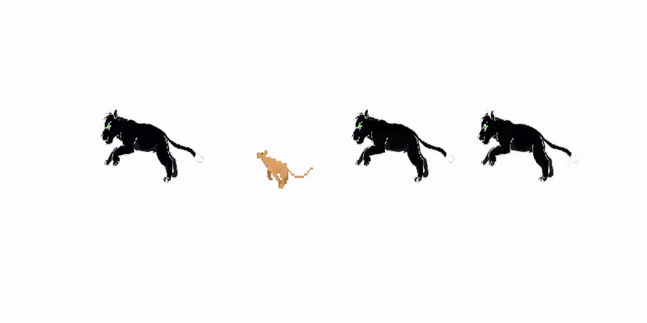

# First Order Motion Model for Image Animation 动态图实现

## 内容

- [模型简介](#模型简介)
- [代码结构](#代码结构)
- [数据准备](#数据准备)
- [模型训练](#模型训练)
- [模型评估](#模型评估)
- [模型推断](#模型推断)
- [参考论文](#参考论文)
- [原项目链接](https://github.com/AliaksandrSiarohin/first-order-model)

## 模型简介

<p align="center">
 <br />
    <font color='gray'>框架示意图 <a href='https://arxiv.org/pdf/2003.00196'>[来源]</a></font>
</p>

简要说明：
1. 将源图像与驱动帧分别输入keypoint detector，分别得到关键点及二者对于参考帧$R$的局部仿射变换，并进一步计算二者的仿射变换$J_k$。
2. 将源图像、关键点与仿射变换输入dense motion，得到optical flow与occlusion map。其中occlusion map用于指示需要被进行inpainting的部分。
3. 结合dense motion输出以及源图像生成目标图像。

## 代码结构
```
src
├── animate.py
├── config                      #配置文件路径
│   ├── bair-256.yaml
│   ├── fashion-256.yaml
│   ├── mgif-256.yaml
│   ├── taichi-256.yaml
│   └── vox-256.yaml
├── demo.py                     #demo脚本
├── frames_dataset.py           #数据集处理
├── LICENSE.md                  #原项目的许可文件
├── modules                     #网络架构类
│   ├── dense_motion.py
│   ├── discriminator.py
│   ├── generator.py
│   ├── keypoint_detector.py
│   ├── model.py
│   └── util.py
└── train.py                    #训练脚本
```


## 数据准备
mgif: https://aistudio.baidu.com/aistudio/datasetdetail/47311
fashion: https://aistudio.baidu.com/aistudio/datasetdetail/49174

- 数据集的gif及视频请缩放到256px\*256px（yaml中可指定其他输入尺寸，但未经测试）

- 并将训练集与测试集按照以下结构放置（该路径可通过yaml配置文件修改）

**数据集路径结构**

```
dataset
├── fashion
│   ├── test
│   └── train
└── moving-gif
    ├── test
    └── train
```

## :warning:模型训练:warning:

**当前模型尚未实现从头训练,且存在以下问题**

| 描述                                                         | 位置                                              | 当前方案                                                     |
| ------------------------------------------------------------ | ------------------------------------------------- | ------------------------------------------------------------ |
| `fluid.layers.grid_sampler`在`align_corners`上与torch可能不一致 | - generator.py<br>- dense_motion.py<br>- model.py | 采用fluid.layers.grid_sampler替代，同时TEST_MODE时设为指定输出 |
| `fluid.layers.interpolate()`缺少align_corners选项            | - generator.py<br>- util.py                       | 采用resize_nearest代替                                       |
| 缺少部分op的二次梯度，`grad()`中无法设置`create_graph=True`  | model.py: Transform.warp_coordinates              | 采用现有op建立一阶梯度计算图，并将一阶梯度作为参数传出，从而计算二阶梯度 |

* 当前脚本中已预留测试模式，该模式下会固定输入数据、模型内随机数以及当前无法等效的op的输出，并会在warning中进行提示，如`fluid.layers.grid_sampler`。

* 开启测试模式后，损失函数处会进入断点并打印各损失函数的值，便于原版模型进行对比。

* 若要开启请令train.py/dense_motino.py/generator.py/model.py中开头部分的`TEST_MODE=True`

数据准备完成后，通过如下方式启动训练：

```bash
train.py --config $PATH_TO_YAML_CONFIG [--save_dir $PATH_TO_SAVE] [--preload]
```

- config:指定配置文件路径， config文件夹中已自带
- preload: 主要用于训练mgif，将数据全部读入内存减少io时间 实测速度影响不大
- 从aistudio中运行代码需要先安装scikit-image

**训练策略：**

*  主要注释已写在配置文件中mgif-256.yaml中

## 模型评估

- 当前存在反向传播问题，故仅与原版的推理结果进行对比，对比结果存放在test_file各文件夹下的result文件中

<p align="center">
 <br />
从左至右: | Source Image | Driving Video | PaddlePaddle | Pytorch |
</p>


## 模型推断

训练完成后，可通过如下方式进行模型推理:

```bash
python demo.py --config $PATH_TO_YAML_CONFIG --source_image $PATH_TO_SOURCE_IMG --driving_video $PATH_TO_DRIVING_VIDEO [--result_video $PATH_TO_RESULT_VIDEO] [--relative] [--adapt_scale] [--cpu]
```

- 进行推理时模型会重新构建网络并载入预训练数据，请确保config的model_params部分与训练时一致，并在ckpt_model中指定各组件的模型路径。**一般只需指定generator和kp.**
- 当前模型可导入pytorch的预训练模型，在fashion/mgif/vox三个数据集上测试通过，[[已转换的预训练模型路径]](https://aistudio.baidu.com/aistudio/datasetdetail/57313)。具体转换方式在底部给出。原文模型地址为[[GDrive]](https://drive.google.com/open?id=1PyQJmkdCsAkOYwUyaj_l-l0as-iLDgeH) [[Yandex]](https://yadi.sk/d/lEw8uRm140L_eQ)
- 保存的文件格式会根据result_video的扩展名调整，若未指定result_video，上述程序会将运行结果保存在./result.mp4文件中。对于gif格式的引导视频，建议以gif格式输出。
- :warning:当前使用cpu推断时部分op出现问题:warning: 使用CPU进行评估时，请加入 --cpu 参数。
```python
# pytorch模型转换
# mgif/vox/fashion模型已通过转换测试
import torch
checkpoint = torch.load('/path/to/ckpt.pth.tar', map_location=torch.device('cpu'))

import numpy as np
V = [i.numpy() for i in checkpoint['discriminator'].values()]
newDict = dict(zip(checkpoint['discriminator'].keys(), V))
np.savez_compressed('/content/mgif/D', newDict)

V = [i.numpy() for i in checkpoint['generator'].values()]
newDict = dict(zip(checkpoint['generator'].keys(), V))
np.savez_compressed('/content/mgif/G', newDict)

V = [i.numpy() for i in checkpoint['kp_detector'].values()]
newDict = dict(zip(checkpoint['generator'].keys(), V))
np.savez_compressed('/content/mgif/KP', newDict)

# 请将config中的generator/discriminator/kp分别指定为生成的G.npz/D.npz/KP.npz
```


## 参考论文

```
@InProceedings{Siarohin_2019_NeurIPS,
  author={Siarohin, Aliaksandr and Lathuilière, Stéphane and Tulyakov, Sergey and Ricci, Elisa and Sebe, Nicu},
  title={First Order Motion Model for Image Animation},
  booktitle = {Conference on Neural Information Processing Systems (NeurIPS)},
  month = {December},
  year = {2019}
}
```